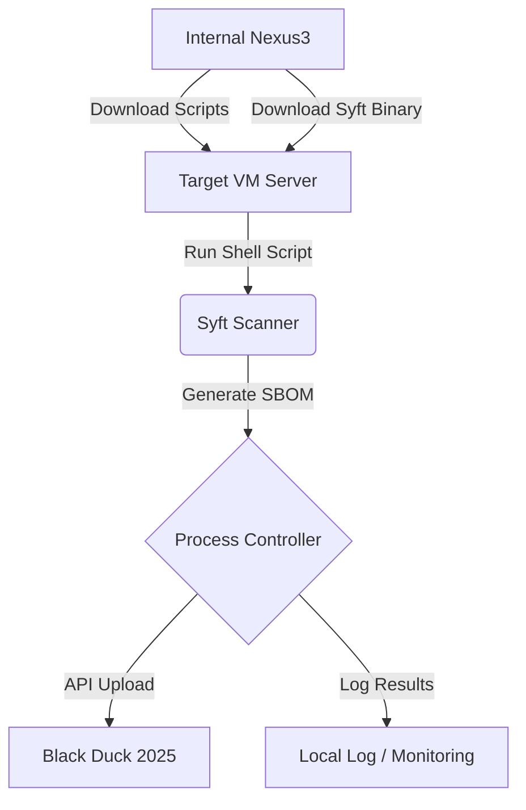

# SBOM 모니터링 시스템 설계서 (DESIGN)

이 문서는 폐쇄망 환경에서 Syft, Black Duck, Nexus3를 활용한 SBOM 모니터링 시스템의 기술적 설계를 다룹니다.

## 1. 시스템 아키텍처

### 1.1. 데이터 흐름도

## 2. 주요 컴포넌트 설계

### 2.1. SBOM Agent (Shell Script)
- **배포 및 관리**: Nexus3 raw repository에서 스크립트와 아키텍처별 Syft 바이너리 관리. (Syft는 스크립트 하위 `./bin/` 디렉토리에 위치)
- **실행 권한**: `sudo` 권한 필수.
- **동작 모드**:
    1. **Setup Mode (최초 실행)**:
        - 서버 환경(Arch) 확인 및 적절한 Syft 바이너리 다운로드
        - **Black Duck 프로젝트명(`BD_PROJECT_NAME`) 입력 및 저장**
        - 스캔 대상 디렉토리 리스트(`TARGET_DIRS`) 설정 및 저장 (복수 등록 지원)
        - 초기 SBOM 스캔 및 결과 전송 테스트
        - **결정적 스케줄 생성 (MAC 해시)**:
            - 서버의 기본 네트워크 인터페이스 MAC 주소를 획득
            - MAC 주소를 수치화(Hash)하여 요일/시간/분을 결정
            - 요일: 0-6 (일-토)
            - 시간: 12:00 ~ 08:00 (다음날) 사이 20개 시간대 중 하나
            - 분: 0-59
        - 생성된 스케줄을 `/etc/cron.d/`에 등록
    2. **Scheduled Mode (주기적 실행)**:
        - **자가 업데이트 체크**: 실행 시 Nexus3에서 스크립트 및 **Syft 바이너리**의 최신 버전 정보를 확인하여 업그레이드 수행
        - 설정된 모든 타겟 디렉토리 리스트에 대해 Syft 실행
        - **데이터 통합**: 모든 경로의 분석 결과가 포함된 단일 통합 SBOM(CycloneDX/SPDX) 생성
        - **단일 분석 요청**: 통합된 SBOM을 Black Duck API의 스캔 데이터 엔드포인트 `/api/scan/data` 로 업로드
        - 이점: 서버(VM) 단위의 전체 소프트웨어 자산 가시성을 하나의 버전에서 확인 가능
        - 실행 결과 로컬 로깅

### 2.2. Asset Manager (Nexus3)
- **역할**: 에이전트 스택(Shell Script, Syft binary)의 중앙 저장소 및 배포처 역할을 수행합니다.

### 2.3. Scheduler & Controller
- **정기 실행**: Cron 또는 별도의 스케줄러를 통해 주기적인 수집 작업을 관리합니다.
- **성공/실패 관리**: 작업 결과를 로그로 남기고, 필요시 알림을 발송합니다.

## 3. 데이터 보관 및 관리 전략

### 3.1. 관리 규칙
- **Black Duck**: 모든 분석 이력과 SBOM 데이터를 버전별로 관리합니다.
- **Local Logs**: `/var/log/sbom-monitor.log`에 실행 이력을 보관합니다.

### 3.2. Black Duck 프로젝트 명명 규칙
- **Project**: `{System-Name}` (또는 필요시 `{Inventory-ID}_{System-Name}`)
- **Version**: `{hostname}-{YYYYMMDDHHMMSS}`
    - 예: `web-server-01-20260220143000`

## 4. 보안 및 폐쇄망 고려사항
- 모든 도구(Syft binary, 종속성)는 사전에 승인된 내부 저장소(Nexus3)에서 인증 없이 다운로드하여 설치합니다.
- Black Duck과의 통신은 내부망용 인증 정보(API Token)를 사용합니다.
